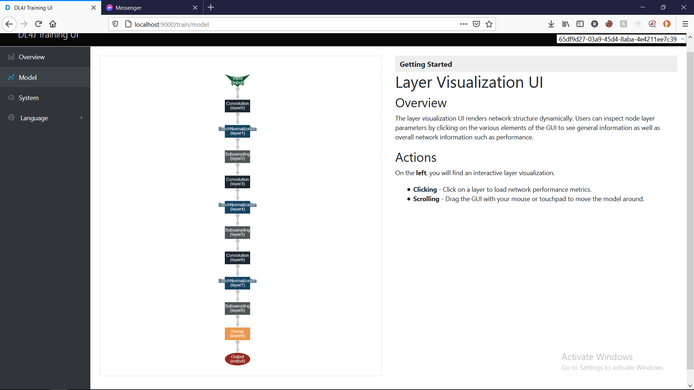
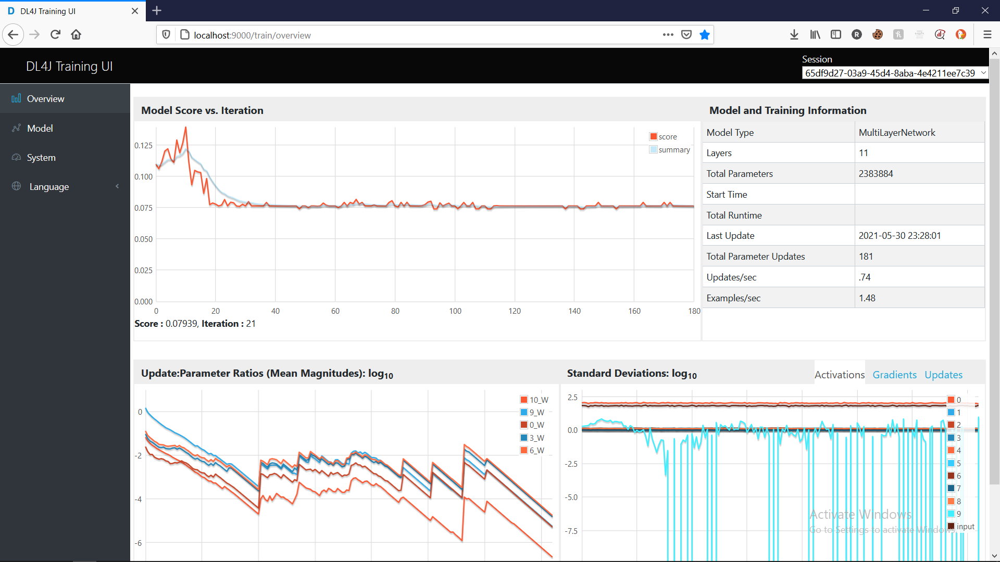
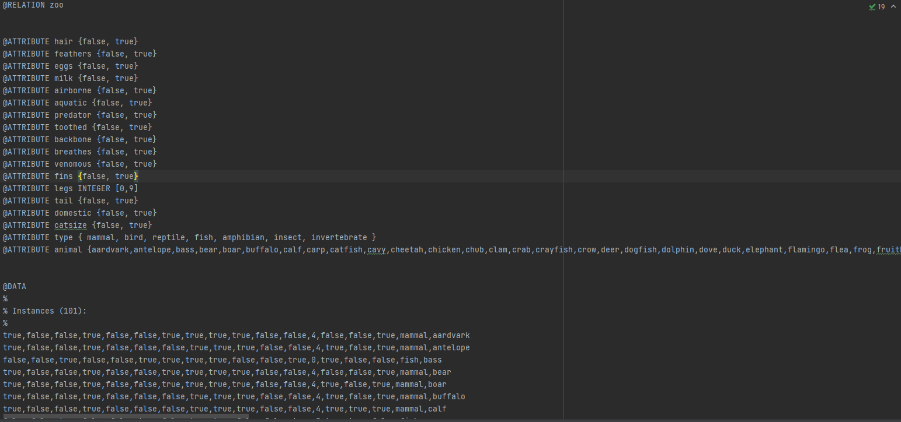

# README
**DeepLearner** project for Advanced Programming Course 2020-2021 @ FII UAIC


@author: Diana Mocanu 2A3
## 0. TODO
   - nn 
   - interpret prediction
   - send predictions
   - edit README.md

## Overview & Indications
The project consists of a web application which allows the user to either take a quiz,
containing questions regarding an animal (decided beforehand) or upload a photo of an animal.

**Quiz feature**: respond to 16 questions regarding an animal you thought of beforehand. A decision tree
algorithm will decide what animal you were thinking about.

**Image upload feature**: upload an image, and a custom neuronal network which has been trained beforehand will
predict the animal in the image.

## 1. Dataset
**1.1 FOR DECISION TREE ALGORTHM**:

**data/zoo-dataset.arff** :  merged from two datasets:

-> https://www.kaggle.com/uciml/zoo-animal-classification?select=zoo.csv

-> https://www.kaggle.com/agajorte/zoo-animals-extended-dataset

**1.2 FOR NEURONAL NETWORK**:

**data/images** 

-> https://www.kaggle.com/piyushkumar18/animal-image-classification-dataset


## 2. Neuronal Network
For the data preprocessing and model architecture and training I used DeepLearning4J library. 
The neuronal network's architecure:

The training data(images belonging to 12 categories), has been processed (resized, shuffled, etc.) and fed to the neuronal network.
The neuronal network's performance:

As seen in the picture above, the loss is fairly good. On the other hand, the overall performance of the network
is not satisfying enough. I tried using CUDA, for using GPU during the training process (which is a lengthy process).

On finishing training, the model generates a file containing weights './model.h5', which is loaded and used for predicting on
user input.

For the statistics regarding the training process, I set up **DL4J Training UI**.

## 3. Machine learning
For the quiz part, I used Decision Tree Algorithm from the **Weka** library.
I transformed the zoo-dataset.csv file to a .arff file (Atribute-Relation File Format).


This file is fed to the DecisionTree Algorithm. A Response entity can be given as parameter to this algorithm,
and classified accordingly.

## 4. Web
For Web, I create a Spring Boot Api, which can receive either a json (containing the quiz responses), or an image (to be classified).
The front-end is rudimentary, completed with HTML/CSS and Javascript.

Response json example:
```json
{
"hasHair" : "true",
"hasFeathers" : "true",
"laysEggs" : "true",
"hasMilk" : "true",
"isAirborne" : "true",
"isAquatic" : "true",
"isPredator" : "true",
"isToothed" : "true",
"hasBackbone" : "true",
"breathes" : "true",
"isVenomous" : "true",
"hasFins" : "true",
"legs" : "4",
"hasTail" : "true",
"isDomestic" : "true",
"isCatsized" : "true"
}
```
The web application is running at **http:\\\localhost:5432**


