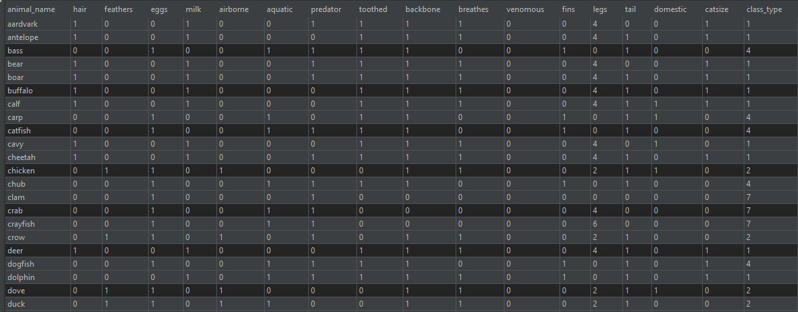
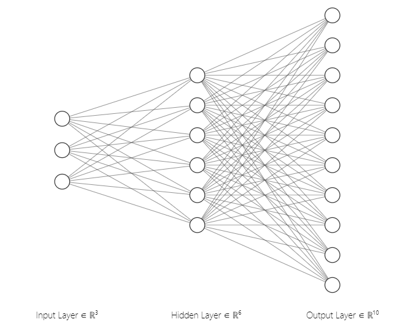

# README
**DeepLearner** project for Advanced Programming Course 2020-2021 @ FII UAIC

@author: Diana Mocanu 2A3
## 0. TODO
   - nn 
   - interpret prediction
   - send predictions
   - edit README.md

## 1. Dataset
**src/main/resources/zoo-dataset.csv** :  merged from two datasets:

-> https://www.kaggle.com/uciml/zoo-animal-classification?select=zoo.csv

-> https://www.kaggle.com/agajorte/zoo-animals-extended-dataset

## 2. Neuronal Network

## 3. Machine learning
decision tree

## 4. Web
api
## 5. User Manual

## 6. Resources

